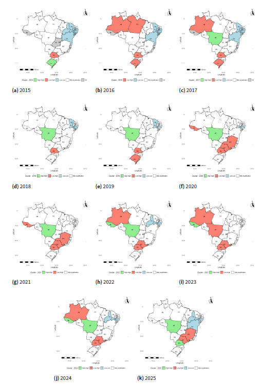
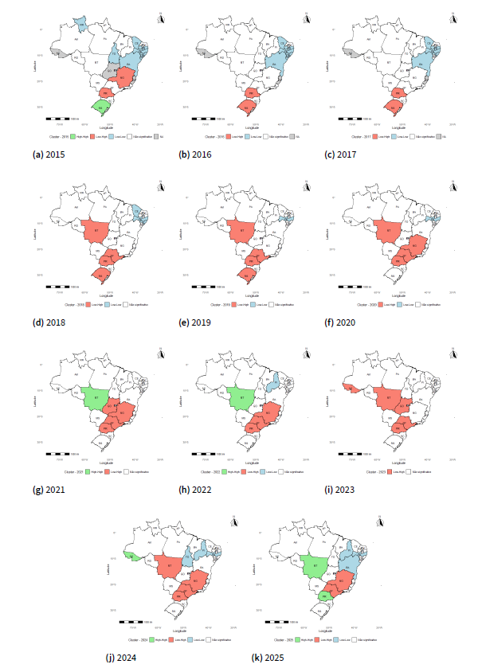

# Abstract

This study examines the temporal and spatial dynamics of rape
victimization rates in Brazil between 2015 and 2025, disaggregated by
sex and Federative Units. Using standardized rates per `\(100,000\)`
inhabitants, the analysis integrates descriptive statistics, three-year
weighted moving averages, consistency indicators, and Local Indicators
of Spatial Association (LISA) to identify structural patterns, temporal
persistence, and localized spatial dependence. The results reveal
pronounced regional disparities, with the North and Central-West regions
consistently exhibiting the highest levels of female victimization. The
LISA analysis further demonstrates that these elevated rates are not
randomly distributed but form statistically significant and persistent
High-High spatial clusters, indicating strong geographic concentration.
Conversely, Low-Low clusters observed in parts of the Northeast and
Southeast suggest spatially structured areas of lower vulnerability.
Although male victimization rates are substantially lower, partially
similar spatial patterns emerge, albeit with weaker and more fragmented
spatial autocorrelation. The findings also indicate that, despite
short-term fluctuations --- particularly during the COVID-19 period ---
several states exhibit persistent upward trends, reinforcing the
interpretation of structural rather than episodic dynamics. The
temporary disruption and subsequent reconfiguration of spatial clusters
further highlight the resilience of underlying spatial processes.
Overall, the combined use of temporal and spatial analytical tools
provides a more nuanced understanding of sexual violence in Brazil,
emphasizing the coexistence of regional inequality, spatial dependence,
and trend persistence. These findings underscore the need for
geographically targeted public policies and improvements in data quality
and reporting systems.

#### Keywords

#### sexual violence; spatial autocorrelation; Local Moran's I; spatial clusters; Brazil.

# Introduction

Sexual violence, particularly rape, has been widely studied across
disciplines including public health, criminology, psychology, and
sociology due to its profound and long‐term impacts on survivors'
physical and mental well‐being. The World Health Organization (WHO)
defines rape as a form of sexual assault involving non‐consensual
penetration, and emphasizes its prevalence as a global public health
concern .

Epidemiological studies have sought to estimate the prevalence and
correlates of rape across populations. For example, population‐based
surveys in high‐income and low‐income countries have documented
significant lifetime prevalence rates, with broad variation by region
and gender. Such cross‐national research highlights the role of social,
economic, and cultural determinants in shaping risk environments for
sexual violence.

Theoretical frameworks for understanding rape include feminist
perspectives that conceptualize sexual violence as rooted in gender
inequalities and power dynamics. Similarly, social ecological models
situate the individual within intersecting layers of influence, from
interpersonal relationships to broader societal norms, to explain
vulnerability and perpetration.

From a psychological perspective, research has emphasized the impacts of
rape on mental health outcomes, showing associations with post‐traumatic
stress, depression, and anxiety among survivors. These studies
underscore the need for trauma‐informed interventions and services as
part of comprehensive public health responses.

Criminological research has examined patterns of reporting, prosecution,
and conviction, revealing systemic barriers that survivors face within
legal systems. Such work calls attention to both the underreporting of
rape and the importance of policy reforms to improve access to justice.

Through these diverse approaches, the literature demonstrates that rape
is not only a criminal act but also a complex social phenomenon with
multifaceted determinants and consequences. An interdisciplinary
perspective is essential for effective research, prevention, and
response strategies.

## Conceptualizing Rape as a Complex Social Phenomenon

Rape is not merely an act of individual violence; it is widely
understood across disciplines as a deeply entrenched social phenomenon
influenced by intersecting cultural, structural, and institutional
factors. Rather than occurring in isolation, sexual violence is produced
within broader systems of gender inequality, power relations, social
norms, and historical structures that shape both vulnerability and
impunity.

One foundational perspective comes from feminist scholars who argue that
rape cannot be fully understood outside the context of gendered power
imbalances. Feminist theorists maintain that sexual violence reflects
and reproduces patriarchal norms that subordinate women and sexual
minorities. From this vantage, rape is not an aberration but a
manifestation of systemic gender inequity, meaning that individual acts
of sexual violence are rooted in social structures that legitimize
domination and control.

Sociological frameworks extend this view by emphasizing the role of
cultural norms and socialization processes. Social norms that tolerate
aggression, reinforce rigid gender roles, or stigmatize victims
contribute to environments in which sexual violence is normalized or
minimized. These norms are often sustained through institutions such as
media, education, and legal systems that reflect prevailing power
dynamics.

Global public health research has further highlighted the complexity of
sexual violence by demonstrating the interplay of individual,
relational, community, and societal risk factors. The ecological
framework conceptualizes sexual violence as the product of factors
operating at multiple levels, ranging from individual history and
behavior to cultural norms and economic inequalities.

Brazilian scholars have also contributed significantly to understanding
sexual violence as a social phenomenon shaped by intersections of
gender, race, class, and historical inequalities. Research in the
Brazilian context reveals how patriarchal norms, machismo culture, and
structural violence intersect to influence the prevalence, reporting,
and social response to rape. Intersectionality, a framework developed to
analyze how multiple axes of inequality (e.g., gender, race, class)
shape experiences of violence, has been increasingly applied in
Brazilian research to unpack how marginalized groups experience sexual
violence differently}.

Beyond social structures, institutional responses including law
enforcement, judicial processes, and health services play a critical
role in shaping survivors' trajectories and societal perceptions of
sexual violence. Studies document how legal barriers, victim‐blaming
attitudes, and inadequate institutional support mechanisms can compound
the harm experienced by survivors and contribute to impunity.

In summary, rape is understood in the academic literature not as an
isolated criminal event but as a complex social phenomenon that emerges
from and is sustained by intersecting social, cultural, economic, and
institutional dynamics. Addressing sexual violence therefore requires
multifaceted strategies that extend beyond criminal justice responses to
encompass cultural change, systemic reform, and intersectional analysis.

# Methodology

This study adopts a quantitative, longitudinal, and comparative approach
to analyze the evolution of rape victimization rates across Brazilian
Federative Units (FUs) from 2015 to 2025, disaggregated by sex. The
methodological framework is structured around three complementary
analytical dimensions: (i) temporal trend analysis, (ii) spatial
heterogeneity assessment, and (iii) consistency evaluation through
directional indicators.The primary data consist of annual rates of rape
victims per \$100,000\$ inhabitants, stratified by sex and FU. These
rates are defined as:

$$ R_{i,t} = \frac{V_{i,t}}{P_{i,t}} \times 100{,}000 $$

where \$R\_{i,t}\$ denotes the victimization rate in Federative Unit
\$i\$ at time \$t\$, \$V\_{i,t}\$ represents the number of reported
victims, and \$P\_{i,t}\$ corresponds to the total population in the
same unit and period. Missing values in specific years were preserved to
avoid introducing artificial bias through imputation, given the
descriptive and exploratory nature of the analysis. All rates were
standardized to ensure comparability across regions and over time.To
enhance interpretability and reduce short-term volatility, a three-year
moving weighted average was computed for each region:

\$\$ \tilde{R}{r,t} = w_1 R{r,t-2} + w_2 R\_{r,t-1} + w_3 R\_{r,t}\$\$

where \$\tilde{R}\_{r,t}\$ is the smoothed rate for region \$r\$ at time
\$t\$, and \$w_1, w_2, w_3\$ are the weights assigned to each year, such
that \$w_1 + w_2 + w_3 = 1\$. In this study, equal weights are assumed
(\$w_1 = w_2 = w_3 = \frac{1}{3}\$), ensuring a balanced contribution of
each period.This procedure allows for the identification of medium-term
trends while attenuating the influence of abrupt annual fluctuations.
The regional vulnerability rankings were derived from these smoothed
values, enabling a clearer comparison of structural patterns across
Brazil's macro-regions. Additionally, a consistency indicator - referred
to as the trend score - was constructed to capture the directionality of
year-to-year changes. For each FU and year, the indicator is defined as:

\$\$ S\_{i,t} = \begin{cases} +1, & \text{if } R\_{i,t} \> R\_{i,t-1} \\
0, & \text{if } R\_{i,t} = R\_{i,t-1} \\ -1, & \text{if } R\_{i,t} \<
R\_{i,t-1} \end{cases} \$\$

The cumulative consistency score for each Federative Unit is then given
by:

\$\$ C_i = \sum\_{t=2}^{T} S\_{i,t} \$\$

where \$C_i\$ represents the overall trend consistency for unit \$i\$,
and \$T\$ is the total number of time periods. The cumulative sum of
these scores provides a synthetic measure of temporal persistence,
allowing the classification of FUs according to the consistency of
upward or downward trends.At the regional level, aggregated consistency
indicators were computed by averaging the FU-level scores:

\$\$ \bar{S}{r,t} = \frac{1}{N_r} \sum{i \in r} S\_{i,t} \$\$

where \$\bar{S}\_{r,t}\$ denotes the average trend score for region
\$r\$ at time \$t\$, and \$N_r\$ is the number of Federative Units
within region \$r\$. This aggregation allows the identification of
broader spatial patterns in the evolution of victimization rates. This
multi-layered approach-combining raw rates, smoothed indicators, and
directional metrics-ensures a robust and comprehensive examination of
both the magnitude and dynamics of sexual violence across Brazil. To
investigate the presence of local spatial autocorrelation and identify
spatial clusters, the Local Moran's I statistic, also known as Local
Indicators of Spatial Association (LISA), was employed. Unlike the
global Moran's I, which provides a single summary measure for the entire
study area, LISA enables the decomposition of spatial dependence at the
individual spatial unit level. Formally, the Local Moran's I statistic
for a given spatial unit \$i\$ is defined as:

\$\$ I_i = z_i \sum\_{j=1}^{n} w\_{ij} z_j \$\$

where \$z_i = x_i - \bar{x}\$ represents the deviation of the observed
value \$x_i\$ from the mean \$\bar{x}\$, and \$w\_{ij}\$ denotes the
spatial weight between units \$i\$ and \$j\$, typically defined through
a spatial weights matrix \$\mathbf{W}\$. The weights matrix reflects the
spatial structure of the data, such as contiguity or distance-based
relationships, and is often row-standardized. An alternative
standardized formulation is given by:

\$\$ I_i = \frac{(x_i - \bar{x})}{S^2} \sum\_{j=1}^{n} w\_{ij} (x_j -
\bar{x}) \$\$

where \$S^2\$ corresponds to the sample variance:

\$\$ S^2 = \frac{1}{n} \sum\_{i=1}^{n} (x_i - \bar{x})^2. \$\$

The statistical significance of \$I_i\$ was assessed using permutation
tests. A 20\\ significance level was adopted to allow greater
flexibility in the detection of statistically significant spatial
clusters, particularly given the exploratory nature of the analysis and
the relatively high spatial variability of the data.Based on the sign
and magnitude of \$I_i\$, as well as the standardized values of \$z_i\$
and the spatial lag \$\sum_j w\_{ij} z_j\$, each spatial unit can be
classified into one of the following cluster types

-   High-High (HH): high values surrounded by high values (hot spots)

-   Low-Low (LL): low values surrounded by low values (cold spots)

-   High-Low (HL): high values surrounded by low values (spatial
    outliers)

-   Low-High (LH)}: low values surrounded by high values (spatial
    outliers).

These classifications enable a detailed spatial interpretation of local
clustering patterns and are commonly visualized using LISA cluster maps.
It is important to note that the interpretation of LISA results depends
critically on the specification of the spatial weights matrix
\$\mathbf{W}\$, as different definitions of neighborhood structure may
lead to different clustering patterns. Therefore, robustness checks
using alternative weighting schemes are recommended. In summary, the
Local Moran's I provides a powerful tool for detecting localized spatial
dependence, uncovering heterogeneity that may be obscured by global
measures, and supporting more nuanced spatial analyses.

# Results and Discussion

The results reveal substantial heterogeneity in both the magnitude and
temporal dynamics of rape victimization rates across Brazilian federal
units (FUs) and regions, with pronounced differences between female and
male populations.

As shown in Table 1, the distribution of female victimization rates and
reveals a clear spatial gradient. The North and Central-West regions
consistently present the highest levels, with extreme values observed in
states such as Mato Grosso do Sul (MS), Rondônia (RO), and Amapá (AP),
where rates frequently exceed 100 cases per \$100{,}000\$ inhabitants.
In contrast, Northeastern states such as Ceará (CE) and Rio Grande do
Norte (RN) display comparatively low and more stable rates over time.
This contrast suggests the presence of structural regional inequalities,
potentially related to differences in socioeconomic conditions,
institutional capacity, and reporting systems.

Table 1: Rate of female rape victims per 100,000 inhabitants, total
variation and moving average over three consecutive years - FU {#tab-1}

| FU | Region | 2015 | 2016 | 2017 | 2018 | 2019 | 2020 | 2021 | 2022 | 2023 | 2024 | 2025 | Total Var. (%) | 2015--2017 | 2016--2018 | 2017--2019 | 2018--2020 | 2019--2021 | 2020--2022 | 2021--2023 | 2022--2024 | 2023--2025 |
|----|----|----|----|----|----|----|----|----|----|----|----|----|----|----|----|----|----|----|----|----|----|----|
| SE | Northeast | 0.0 | 0.0 | 0.0 | 1.5 | 12.7 | 11.9 | 11.7 | 14.2 | 18.2 | 18.0 | 19.7 | -- | 0.0 | 0.5 | 4.7 | 8.7 | 12.1 | 12.6 | 14.7 | 16.8 | 18.6 |
| AC | North | -- | -- | -- | 17.3 | 29.0 | 20.8 | 29.5 | 55.9 | 56.4 | 40.0 | 25.3 | -- | -- | 5.8 | 15.4 | 22.4 | 26.5 | 35.4 | 47.3 | 50.8 | 40.6 |
| AL | Northeast | 9.7 | 9.0 | 13.3 | 9.8 | 11.1 | 8.9 | 13.2 | 13.5 | 13.3 | 15.1 | 10.5 | 7.8 | 10.6 | 10.7 | 11.4 | 9.9 | 11.1 | 11.9 | 13.3 | 14.0 | 13.0 |
| AM | North | 12.6 | 17.0 | 15.9 | 13.8 | 13.1 | 10.6 | 9.8 | 12.2 | 12.2 | 16.0 | 17.4 | 37.6 | 15.2 | 15.6 | 14.3 | 12.5 | 11.2 | 10.9 | 11.4 | 13.5 | 15.2 |
| AP | North | 85.1 | 103.4 | 0.0 | 97.8 | 44.3 | 31.1 | 40.8 | 34.7 | 36.1 | 33.4 | 30.9 | -63.7 | 62.8 | 67.1 | 47.4 | 57.7 | 38.8 | 35.6 | 37.2 | 34.8 | 33.5 |
| BA | Northeast | 10.8 | 11.0 | 11.8 | 12.1 | 12.5 | 10.4 | 34.2 | 14.3 | 15.0 | 14.9 | 13.2 | 23.0 | 11.2 | 11.6 | 12.1 | 11.7 | 19.0 | 19.6 | 21.2 | 14.7 | 14.4 |
| CE | Northeast | 10.1 | 10.6 | 10.4 | 9.1 | 9.7 | 6.8 | 7.0 | 7.6 | 6.9 | 6.5 | 6.3 | -37.8 | 10.4 | 10.0 | 9.7 | 8.5 | 7.8 | 7.1 | 7.2 | 7.0 | 6.6 |
| DF | Central-West | 42.7 | 36.9 | 45.8 | 18.7 | 17.1 | 15.3 | 14.4 | 14.0 | 17.8 | 18.5 | 15.8 | -62.9 | 41.8 | 33.8 | 27.2 | 17.1 | 15.6 | 14.6 | 15.4 | 16.7 | 17.4 |
| ES | Southeast | -- | -- | -- | 56.7 | 63.2 | 55.4 | 53.7 | 65.9 | 19.0 | 71.2 | 15.7 | -- | -- | 18.9 | 40.0 | 58.4 | 57.5 | 58.4 | 46.2 | 52.0 | 35.3 |
| GO | Central-West | -- | 15.7 | 19.0 | 21.8 | 24.4 | 18.4 | 22.5 | 20.7 | 19.5 | 19.7 | 18.0 | -- | 11.6 | 18.9 | 21.8 | 21.6 | 21.8 | 20.5 | 20.9 | 20.0 | 19.1 |
| MA | Northeast | 22.0 | 24.0 | 28.0 | 27.7 | 34.0 | 32.2 | 13.3 | 12.1 | 10.5 | 9.8 | 10.9 | -50.4 | 24.7 | 26.6 | 29.9 | 31.3 | 26.5 | 19.2 | 12.0 | 10.8 | 10.4 |
| MG | Southeast | 16.1 | 15.7 | 15.8 | 15.7 | 13.4 | 11.3 | 10.9 | 10.2 | 10.9 | 12.5 | 11.3 | -29.4 | 15.9 | 15.8 | 15.0 | 13.5 | 11.9 | 10.8 | 10.7 | 11.2 | 11.6 |
| MS | Central-West | 41.2 | 50.9 | 60.9 | 142.0 | 154.7 | 141.3 | 138.9 | 132.9 | 162.0 | 133.4 | 86.1 | 108.9 | 51.0 | 84.6 | 119.2 | 146.0 | 145.0 | 137.7 | 144.6 | 142.7 | 127.2 |
| MT | Central-West | 28.9 | 39.0 | 41.4 | 37.9 | 38.4 | 35.7 | 32.1 | 33.4 | 34.5 | 33.4 | 34.0 | 17.7 | 36.4 | 39.4 | 39.2 | 37.3 | 35.4 | 33.7 | 33.3 | 33.8 | 33.9 |
| PA | North | 13.7 | 23.8 | 21.4 | 20.1 | 18.7 | 16.4 | 15.1 | 17.4 | 20.1 | 18.5 | 15.8 | 15.4 | 19.7 | 21.8 | 20.1 | 18.4 | 16.7 | 16.3 | 17.6 | 18.7 | 18.1 |
| PB | Northeast | 12.4 | 20.9 | 14.6 | 11.6 | 12.7 | 14.2 | 20.0 | 21.9 | 24.6 | 11.2 | 11.8 | -4.1 | 15.9 | 15.7 | 13.0 | 12.8 | 15.6 | 18.7 | 22.2 | 19.2 | 15.9 |
| PE | Northeast | 15.9 | 17.1 | 18.3 | 17.7 | 16.0 | 14.8 | 13.9 | 14.8 | 15.7 | 14.4 | 12.2 | -23.0 | 17.1 | 17.7 | 17.3 | 16.1 | 14.9 | 14.5 | 14.8 | 15.0 | 14.1 |
| PI | Northeast | 7.8 | 10.3 | 11.7 | 13.0 | 14.4 | 10.9 | 11.0 | 15.2 | 17.4 | 13.4 | 14.7 | 89.5 | 9.9 | 11.7 | 13.0 | 12.8 | 12.1 | 12.4 | 14.5 | 15.3 | 15.2 |
| PR | South | 16.6 | 19.1 | 22.6 | 22.9 | 23.4 | 20.7 | 22.3 | 24.8 | 26.8 | 29.0 | 22.6 | 36.1 | 19.4 | 21.5 | 23.0 | 22.3 | 22.1 | 22.6 | 24.6 | 26.9 | 26.2 |
| RJ | Southeast | 46.9 | 45.3 | 46.9 | 50.7 | 52.0 | 45.1 | 48.6 | 53.6 | 51.7 | 54.3 | 54.6 | 16.4 | 46.4 | 47.6 | 49.9 | 49.3 | 48.6 | 49.1 | 51.3 | 53.2 | 53.5 |
| RN | Northeast | 5.9 | 8.3 | 3.1 | 9.2 | 10.2 | 11.3 | 9.6 | 12.9 | 15.1 | 14.6 | 17.1 | 192.0 | 5.8 | 6.9 | 7.5 | 10.2 | 10.4 | 11.3 | 12.5 | 14.2 | 15.6 |
| RO | North | 53.6 | 65.1 | 100.0 | 122.2 | 125.0 | 104.1 | 108.4 | 108.7 | 166.0 | 157.7 | 27.3 | -49.1 | 72.9 | 95.7 | 115.7 | 117.1 | 112.5 | 107.1 | 127.7 | 144.1 | 117.0 |
| RR | North | 30.4 | 55.9 | 64.8 | 29.2 | 36.1 | 38.4 | 46.5 | 52.4 | 38.9 | 48.4 | 37.3 | 22.7 | 50.4 | 49.9 | 43.3 | 34.6 | 40.3 | 45.8 | 45.9 | 46.6 | 41.5 |
| RS | South | 27.7 | 26.8 | 28.2 | 32.7 | 23.8 | 18.6 | 18.5 | 18.8 | 19.5 | 18.3 | 16.3 | -41.3 | 27.6 | 29.2 | 28.2 | 25.0 | 20.3 | 18.6 | 18.9 | 18.9 | 18.0 |
| SC | South | 55.5 | 65.2 | 69.9 | 78.1 | 104.8 | 29.0 | 37.9 | 38.4 | 37.1 | 36.9 | 27.6 | -50.3 | 63.5 | 71.1 | 84.3 | 70.6 | 57.2 | 35.1 | 37.8 | 37.5 | 33.9 |
| SP | Southeast | 40.6 | 34.7 | 15.1 | 14.2 | 13.6 | 11.3 | 10.4 | 11.9 | 13.3 | 13.5 | 13.2 | -67.6 | 30.1 | 21.3 | 14.3 | 13.0 | 11.7 | 11.2 | 11.9 | 12.9 | 13.3 |
| TO | North | 25.7 | 37.3 | 45.8 | 86.9 | 98.1 | 19.5 | 22.7 | 21.9 | 91.0 | 25.7 | 19.9 | -22.6 | 36.3 | 56.7 | 77.0 | 68.2 | 46.8 | 21.4 | 45.2 | 46.2 | 45.5 |

Beyond cross-sectional disparities, the temporal evolution of female
victimization rates indicates important structural shifts. Several FUs
exhibit sharp increases between 2018 and 2019, followed by partial
declines in 2020. This pattern is consistent with disruptions associated
with the COVID-19 pandemic, which may have affected both the incidence
of violence and, more importantly, reporting mechanisms. Notably, the
subsequent period (2021--2025) shows renewed upward trends in multiple
states, reinforcing the interpretation that the pandemic likely produced
a temporary suppression of reported cases rather than a sustained
reduction in underlying violence.

Regional heterogeneity is also evident within more developed areas. In
the Southeast, São Paulo (SP) and Minas Gerais (MG) exhibit relatively
low and declining trajectories, suggesting gradual improvements or
stabilization. In contrast, Rio de Janeiro (RJ) maintains persistently
high rates throughout the period, while Espírito Santo (ES) shows marked
volatility, with abrupt fluctuations that may reflect inconsistencies in
reporting or localized shocks. These intra-regional differences
highlight that aggregate regional patterns may obscure substantial
subnational variation.

Table 2, which presents male victimization rates, reinforces the
strongly gendered nature of sexual violence, as levels are
systematically lower across all FUs. However, the spatial distribution
of male victimization partially mirrors that observed among females. The
Central-West region, particularly Mato Grosso do Sul (MS), again stands
out with comparatively elevated rates, suggesting that underlying
structural risk factors --- such as social vulnerability, violence
dynamics, and institutional effectiveness --- affect both sexes, albeit
with different magnitudes.

Table 2: Rate of male rape victims per 100,000 inhabitants, total
variation and moving average over three consecutive years - FU

| FU | Region | 2015 | 2016 | 2017 | 2018 | 2019 | 2020 | 2021 | 2022 | 2023 | 2024 | 2025 | Total Var. (%) | 2015--2017 | 2016--2018 | 2017--2019 | 2018--2020 | 2019--2021 | 2020--2022 | 2021--2023 | 2022--2024 | 2023--2025 |
|----|----|----|----|----|----|----|----|----|----|----|----|----|----|----|----|----|----|----|----|----|----|----|
| SE | Northeast | 0.0 | 0.0 | 0.0 | 0.2 | 2.0 | 1.3 | 1.9 | 1.4 | 0.8 | 1.8 | 0.8 | -- | 0.0 | 0.1 | 0.7 | 1.1 | 1.7 | 1.5 | 1.4 | 1.3 | 1.1 |
| AC | North | -- | -- | -- | 1.8 | 2.3 | 1.8 | 2.0 | 3.5 | 1.3 | 4.0 | 0.4 | -- | -- | 0.6 | 1.4 | 2.0 | 2.0 | 2.4 | 2.3 | 2.9 | 1.9 |
| AL | Northeast | 0.8 | 0.4 | 1.2 | 1.0 | 0.9 | 0.6 | 0.9 | 0.5 | 0.6 | 1.5 | 1.0 | 37.4 | 0.8 | 0.9 | 1.0 | 0.8 | 0.8 | 0.7 | 0.7 | 0.9 | 1.0 |
| AM | North | 0.8 | 1.6 | 1.8 | 0.9 | 1.0 | 0.5 | 0.4 | 0.6 | 1.2 | 1.3 | 1.1 | 35.2 | 1.4 | 1.4 | 1.2 | 0.8 | 0.6 | 0.5 | 0.7 | 1.0 | 1.2 |
| AP | North | 9.5 | 9.8 | 0.0 | 10.6 | 1.9 | 0.9 | 1.1 | 1.1 | 1.3 | 2.8 | 1.3 | -86.5 | 6.4 | 6.8 | 4.2 | 4.5 | 1.3 | 1.1 | 1.2 | 1.7 | 1.8 |
| BA | Northeast | 0.8 | 0.8 | 0.9 | 0.8 | 0.8 | 0.8 | 4.7 | 0.9 | 1.2 | 1.2 | 0.8 | 2.4 | 0.9 | 0.9 | 0.9 | 0.8 | 2.1 | 2.1 | 2.3 | 1.1 | 1.1 |
| CE | Northeast | 1.3 | 0.9 | 1.1 | 1.0 | 0.9 | 0.8 | 0.6 | 0.7 | 0.6 | 0.7 | 0.7 | -43.1 | 1.1 | 1.0 | 1.0 | 0.9 | 0.8 | 0.7 | 0.7 | 0.7 | 0.7 |
| DF | Central-West | 8.1 | 5.0 | 7.3 | 2.3 | 1.5 | 1.9 | 2.0 | 1.6 | 2.3 | 1.6 | 1.2 | -85.0 | 6.8 | 4.9 | 3.7 | 1.9 | 1.8 | 1.8 | 1.9 | 1.8 | 1.7 |
| ES | Southeast | -- | -- | -- | 8.8 | 11.2 | 7.5 | 8.1 | 8.4 | 1.8 | 12.3 | 1.6 | -- | -- | 2.9 | 6.7 | 9.2 | 9.0 | 8.0 | 6.1 | 7.5 | 5.2 |
| GO | Central-West | -- | 0.8 | 1.4 | 1.2 | 1.3 | 1.2 | 1.4 | 1.6 | 1.6 | 1.0 | 1.4 | -- | 0.7 | 1.1 | 1.3 | 1.2 | 1.3 | 1.4 | 1.5 | 1.4 | 1.4 |
| MA | Northeast | 5.0 | 5.7 | 6.2 | 6.4 | 5.5 | 5.6 | 1.0 | 0.4 | 0.3 | 0.4 | 0.7 | -85.9 | 5.6 | 6.1 | 6.0 | 5.8 | 4.0 | 2.3 | 0.6 | 0.4 | 0.5 |
| MG | Southeast | 1.4 | 1.1 | 1.1 | 0.9 | 0.8 | 0.8 | 0.7 | 0.5 | 0.8 | 0.9 | 0.9 | -31.3 | 1.2 | 1.0 | 1.0 | 0.8 | 0.8 | 0.6 | 0.7 | 0.7 | 0.9 |
| MS | Central-West | 4.7 | 5.8 | 8.1 | 21.2 | 22.7 | 18.9 | 17.4 | 15.1 | 19.8 | 17.9 | 12.0 | 156.3 | 6.2 | 11.7 | 17.3 | 20.9 | 19.7 | 17.1 | 17.4 | 17.6 | 16.6 |
| MT | Central-West | 2.3 | 3.2 | 3.2 | 3.3 | 2.9 | 2.5 | 3.2 | 3.0 | 2.1 | 3.5 | 2.3 | 1.2 | 2.9 | 3.2 | 3.2 | 2.9 | 2.9 | 2.9 | 2.8 | 2.9 | 2.6 |
| PA | North | 0.5 | 1.1 | 0.8 | 1.1 | 1.1 | 0.9 | 0.7 | 1.1 | 1.0 | 1.2 | 1.1 | 103.1 | 0.8 | 1.0 | 1.0 | 1.1 | 0.9 | 0.9 | 0.9 | 1.1 | 1.1 |
| PB | Northeast | 2.0 | 1.9 | 3.2 | 0.9 | 1.6 | 0.8 | 1.9 | 2.4 | 2.6 | 0.8 | 0.8 | -59.8 | 2.4 | 2.0 | 1.9 | 1.1 | 1.5 | 1.7 | 2.3 | 1.9 | 1.4 |
| PE | Northeast | 1.5 | 2.0 | 1.7 | 1.8 | 2.1 | 1.1 | 1.4 | 1.3 | 1.1 | 0.9 | 1.3 | -10.0 | 1.7 | 1.8 | 1.9 | 1.7 | 1.6 | 1.3 | 1.3 | 1.1 | 1.1 |
| PI | Northeast | 0.7 | 1.1 | 1.3 | 0.7 | 1.1 | 0.7 | 1.4 | 1.3 | 0.5 | 1.1 | 1.2 | 70.8 | 1.0 | 1.0 | 1.0 | 0.8 | 1.1 | 1.1 | 1.0 | 0.9 | 0.9 |
| PR | South | 2.6 | 2.4 | 2.7 | 2.6 | 2.7 | 2.1 | 2.2 | 2.4 | 2.5 | 2.9 | 2.3 | -9.1 | 2.6 | 2.6 | 2.7 | 2.5 | 2.4 | 2.3 | 2.4 | 2.6 | 2.6 |
| RJ | Southeast | 8.7 | 7.5 | 8.6 | 8.5 | 8.4 | 7.2 | 7.5 | 7.7 | 8.2 | 8.5 | 8.3 | -5.0 | 8.3 | 8.2 | 8.5 | 8.1 | 7.7 | 7.5 | 7.8 | 8.2 | 8.3 |
| RN | Northeast | 0.2 | 0.6 | 0.1 | 0.4 | 1.2 | 0.5 | 0.6 | 0.9 | 0.8 | 1.1 | 1.4 | 481.0 | 0.3 | 0.4 | 0.5 | 0.7 | 0.8 | 0.7 | 0.8 | 0.9 | 1.1 |
| RO | North | 9.5 | 10.4 | 11.2 | 16.0 | 15.3 | 12.9 | 9.2 | 10.3 | 19.2 | 19.2 | 2.7 | -71.2 | 10.4 | 12.6 | 14.2 | 14.7 | 12.5 | 10.8 | 12.9 | 16.2 | 13.7 |
| RR | North | 2.3 | 1.5 | 3.6 | 4.7 | 1.9 | 3.4 | 1.5 | 1.1 | 3.4 | 3.9 | 2.7 | 18.5 | 2.5 | 3.3 | 3.4 | 3.3 | 2.3 | 2.0 | 2.0 | 2.8 | 3.3 |
| RS | South | 3.8 | 3.2 | 3.0 | 3.9 | 2.0 | 1.1 | 1.4 | 1.2 | 1.3 | 1.3 | 1.2 | -69.9 | 3.3 | 3.4 | 3.0 | 2.3 | 1.5 | 1.2 | 1.3 | 1.3 | 1.3 |
| SC | South | 10.1 | 10.8 | 11.4 | 13.0 | 16.7 | 2.8 | 3.7 | 3.7 | 3.8 | 4.6 | 2.9 | -71.2 | 10.8 | 11.7 | 13.7 | 10.8 | 7.7 | 3.4 | 3.7 | 4.0 | 3.8 |
| SP | Southeast | 10.3 | 8.3 | 1.5 | 1.3 | 1.1 | 1.1 | 1.0 | 1.2 | 0.9 | 1.0 | 1.1 | -89.4 | 6.7 | 3.7 | 1.3 | 1.2 | 1.1 | 1.1 | 1.0 | 1.0 | 1.0 |
| TO | North | 3.7 | 10.9 | 7.5 | 10.1 | 11.5 | 1.5 | 0.6 | 1.3 | 9.5 | 2.6 | 0.7 | -80.6 | 7.4 | 9.5 | 9.7 | 7.7 | 4.5 | 1.2 | 3.8 | 4.5 | 4.3 |

From a temporal perspective, male victimization rates exhibit lower
volatility and a narrower dispersion across FUs when compared to female
rates. This pattern may indicate more stable reporting dynamics,
although it may also reflect persistent underreporting among male
victims. Despite this overall stability, some states --- notably
Rondônia (RO) and Amapá (AP) --- display episodic spikes, which could be
associated with localized changes in violence patterns or improvements
in detection and reporting systems.

Taken together, the results from both tables suggest that sexual
violence in Brazil is characterized by strong regional inequalities,
temporal discontinuities associated with external shocks such as the
pandemic, and a pronounced gender asymmetry. While female victimization
remains substantially higher, the persistence of similar spatial
patterns across sexes points to common structural determinants that
warrant further investigation.

The regional vulnerability rankings based on three-year weighted
averages (Table 3 and Table 4) provide a clearer picture of structural
inequalities. For females, the Central-West and North regions
consistently occupy the highest positions, confirming their status as
areas of greater vulnerability. The Northeast, while showing moderate
levels, demonstrates relative stability over time. In contrast, the
Southeast and South regions maintain lower averages, although not
uniformly, as evidenced by the persistent high rates in specific states
such as Rio de Janeiro.

Table 3: Regional female vulnerability ranking

| Region       | 2015 | 2016 | 2017 | 2018 | 2019 | 2020 | 2021 | 2022 | 2023 | 2024 | 2025 |
|--------------|------|------|------|------|------|------|------|------|------|------|------|
| Northeast    | 10.5 | 12.4 | 12.4 | 12.4 | 14.8 | 13.5 | 14.9 | 14.1 | 15.2 | 13.1 | 13.0 |
| North        | 36.8 | 50.4 | 41.3 | 61.6 | 55.9 | 36.7 | 40.6 | 41.2 | 60.7 | 49.9 | 24.8 |
| Central-West | 37.6 | 42.3 | 49.4 | 66.2 | 70.1 | 64.1 | 61.8 | 60.1 | 71.4 | 61.7 | 45.3 |
| Southeast    | 34.5 | 31.9 | 25.9 | 26.9 | 26.3 | 22.5 | 23.3 | 25.3 | 25.3 | 26.8 | 26.4 |
| South        | 33.3 | 37.0 | 40.2 | 44.5 | 50.7 | 22.8 | 26.2 | 27.3 | 27.8 | 28.1 | 22.2 |

For males, the regional hierarchy is similar but less pronounced. The
Central-West again emerges as the most vulnerable region, followed by
the North, while the Northeast consistently presents the lowest
averages. Notably, the temporal evolution suggests a general decline in
male victimization rates after 2019, particularly in the North region,
where the weighted average drops significantly by 2025.

Table 4: Regional male vulnerability ranking

| Region       | 2015 | 2016 | 2017 | 2018 | 2019 | 2020 | 2021 | 2022 | 2023 | 2024 | 2025 |
|--------------|------|------|------|------|------|------|------|------|------|------|------|
| Northeast    | 1.4  | 1.5  | 1.7  | 1.5  | 1.8  | 1.4  | 1.6  | 1.1  | 0.9  | 1.1  | 1.0  |
| North        | 4.4  | 5.9  | 4.2  | 7.2  | 5.5  | 3.3  | 2.2  | 2.6  | 5.9  | 5.2  | 1.6  |
| Central-West | 5.0  | 4.7  | 6.2  | 8.9  | 9.0  | 7.8  | 7.5  | 6.6  | 8.0  | 7.7  | 5.2  |
| Southeast    | 6.8  | 5.7  | 3.7  | 3.6  | 3.5  | 3.0  | 3.0  | 3.2  | 3.3  | 3.5  | 3.4  |
| South        | 5.5  | 5.5  | 5.7  | 6.5  | 7.1  | 2.0  | 2.4  | 2.5  | 2.5  | 3.0  | 2.1  |

The consistency indicators at the FU level (Table 5 and Table 6) offer
further insights into the persistence of trends. Among females, states
such as Piauí (PI) and Paraná (PR) achieve the highest scores,
indicating a sustained upward trajectory in victimization rates.
Conversely, states like Amapá (AP), Distrito Federal (DF), and São Paulo
(SP) display negative scores, reflecting either declining trends or high
volatility with frequent reversals.

Table 5: Consistency indicator (Trend score) for females by FU

| UF  | Region       | 2015 | 2016 | 2017 | 2018 | 2019 | 2020 | 2021 | 2022 | 2023 | 2024 | 2025 | Ranking |
|-----|--------------|------|------|------|------|------|------|------|------|------|------|------|---------|
| SE  | Northeast    | 0    | 0    | 0    | 1    | 1    | -1   | -1   | 1    | 1    | 1    | 1    | 4       |
| AC  | North        | NA   | NA   | NA   | 1    | 1    | -1   | 1    | 1    | 1    | -1   | -1   | 2       |
| AL  | Northeast    | 0    | -1   | 1    | -1   | 1    | -1   | 1    | 1    | -1   | 1    | -1   | 0       |
| AM  | North        | 0    | 1    | -1   | -1   | -1   | -1   | -1   | 1    | 0    | 1    | 1    | -1      |
| AP  | North        | 0    | 1    | -1   | 1    | -1   | -1   | 1    | -1   | -1   | -1   | -1   | -4      |
| BA  | Northeast    | 0    | 1    | 1    | 1    | 1    | -1   | 1    | -1   | 1    | -1   | -1   | 2       |
| CE  | Northeast    | 0    | 1    | -1   | -1   | 1    | -1   | 1    | 1    | -1   | -1   | -1   | -2      |
| DF  | Central-West | 0    | -1   | 1    | -1   | -1   | -1   | -1   | -1   | 1    | 1    | -1   | -4      |
| ES  | Southeast    | NA   | NA   | NA   | 0    | 1    | -1   | -1   | 1    | -1   | 1    | -1   | -1      |
| GO  | Central-West | NA   | 0    | 1    | 1    | 1    | -1   | 1    | -1   | -1   | 1    | -1   | 1       |
| MA  | Northeast    | 0    | 1    | 1    | -1   | 1    | -1   | -1   | -1   | -1   | -1   | 1    | -2      |
| MG  | Southeast    | 0    | -1   | 1    | -1   | -1   | -1   | -1   | -1   | 1    | 1    | -1   | -4      |
| MS  | Central-West | 0    | 1    | 1    | 1    | 1    | -1   | -1   | -1   | 1    | -1   | -1   | 0       |
| MT  | Central-West | 0    | 1    | 1    | -1   | 1    | -1   | -1   | 1    | 1    | -1   | 1    | 2       |
| PA  | North        | 0    | 1    | -1   | -1   | -1   | -1   | -1   | 1    | 1    | 1    | -1   | -2      |
| PB  | Northeast    | 0    | 1    | -1   | -1   | 1    | 1    | 1    | 1    | 1    | -1   | 1    | 4       |
| PE  | Northeast    | 0    | 1    | 1    | -1   | -1   | -1   | -1   | 1    | 1    | -1   | -1   | -2      |
| PI  | Northeast    | 0    | 1    | 1    | 1    | 1    | -1   | 1    | 1    | 1    | -1   | 1    | 6       |
| PR  | South        | 0    | 1    | 1    | 1    | 1    | -1   | 1    | 1    | 1    | 1    | -1   | 6       |
| RJ  | Southeast    | 0    | -1   | 1    | 1    | 1    | -1   | 1    | 1    | -1   | 1    | 1    | 4       |
| RN  | Northeast    | 0    | 1    | -1   | 1    | 1    | 1    | -1   | 1    | 1    | -1   | 1    | 4       |
| RO  | North        | 0    | 1    | 1    | 1    | 1    | -1   | 1    | 1    | 1    | -1   | -1   | 4       |
| RR  | North        | 0    | 1    | 1    | -1   | 1    | 1    | 1    | 1    | -1   | 1    | -1   | 4       |
| RS  | South        | 0    | -1   | 1    | 1    | -1   | -1   | -1   | 1    | 1    | -1   | 1    | 0       |
| SC  | South        | 0    | 1    | 1    | 1    | 1    | -1   | 1    | 1    | -1   | -1   | -1   | 2       |
| SP  | Southeast    | 0    | -1   | -1   | -1   | -1   | -1   | -1   | 1    | 1    | 1    | -1   | -4      |
| TO  | North        | 0    | 1    | 1    | 1    | 1    | -1   | 1    | -1   | 1    | -1   | -1   | 2       |

For males, the pattern is less consistent, with fewer states exhibiting
strong positive or negative cumulative scores. Santa Catarina (SC)
stands out with the highest positive ranking, suggesting a persistent
increase, whereas Rio Grande do Sul (RS) shows the most negative score,
indicating a consistent decline.

Table 6: Consistency indicator (Trend score) for males by FU

| FU  | Region       | 2015 | 2016 | 2017 | 2018 | 2019 | 2020 | 2021 | 2022 | 2023 | 2024 | 2025 | Ranking |
|-----|--------------|------|------|------|------|------|------|------|------|------|------|------|---------|
| SE  | Northeast    | 0    | 0    | 0    | 1    | 1    | -1   | 1    | -1   | -1   | 1    | -1   | 0       |
| AC  | North        | NA   | NA   | NA   | 0    | 1    | -1   | 1    | 1    | -1   | 1    | -1   | 1       |
| AL  | Northeast    | 0    | -1   | 1    | -1   | -1   | -1   | 1    | -1   | -1   | 1    | -1   | -4      |
| AM  | North        | 0    | 1    | 1    | -1   | 1    | -1   | -1   | 1    | 1    | 1    | -1   | 2       |
| AP  | North        | 0    | 1    | -1   | 1    | -1   | -1   | -1   | 0    | 1    | 1    | -1   | -1      |
| BA  | Northeast    | 0    | 0    | 1    | -1   | 0    | 0    | 1    | -1   | 1    | 0    | 0    | 1       |
| CE  | Northeast    | 0    | -1   | 1    | -1   | -1   | -1   | -1   | 1    | -1   | 1    | 0    | -3      |
| DF  | Central-West | 0    | -1   | 1    | -1   | -1   | 1    | 1    | -1   | 1    | -1   | -1   | -2      |
| ES  | Southeast    | NA   | NA   | NA   | 0    | 1    | -1   | 1    | 1    | -1   | 1    | -1   | 1       |
| GO  | Central-West | NA   | 0    | 1    | -1   | 1    | -1   | 1    | 1    | 0    | -1   | 1    | 2       |
| MA  | Northeast    | 0    | 1    | 1    | 1    | -1   | 1    | -1   | -1   | -1   | 1    | 1    | 2       |
| MG  | Southeast    | 0    | -1   | 0    | -1   | -1   | 0    | -1   | -1   | 1    | 1    | 0    | -3      |
| MS  | Central-West | 0    | 1    | 1    | 1    | 1    | -1   | -1   | -1   | 1    | -1   | -1   | 0       |
| MT  | Central-West | 0    | 1    | 0    | 1    | -1   | -1   | 1    | -1   | -1   | 1    | -1   | -1      |
| PA  | North        | 0    | 1    | -1   | 1    | 0    | -1   | -1   | 1    | -1   | 1    | -1   | -1      |
| PB  | Northeast    | 0    | -1   | 1    | -1   | 1    | -1   | 1    | 1    | 1    | -1   | 0    | 1       |
| PE  | Northeast    | 0    | 1    | -1   | 1    | 1    | -1   | 1    | -1   | -1   | -1   | 1    | 0       |
| PI  | Northeast    | 0    | 1    | 1    | -1   | 1    | -1   | 1    | -1   | -1   | 1    | 1    | 2       |
| PR  | South        | 0    | -1   | 1    | -1   | 1    | -1   | 1    | 1    | 1    | 1    | -1   | 2       |
| RJ  | Southeast    | 0    | -1   | 1    | -1   | -1   | -1   | 1    | 1    | 1    | 1    | -1   | 0       |
| RN  | Northeast    | 0    | 1    | -1   | 1    | 1    | -1   | 1    | 1    | -1   | 1    | 1    | 4       |
| RO  | North        | 0    | 1    | 1    | 1    | -1   | -1   | -1   | 1    | 1    | 0    | -1   | 1       |
| RR  | North        | 0    | -1   | 1    | 1    | -1   | 1    | -1   | -1   | 1    | 1    | -1   | 0       |
| RS  | South        | 0    | -1   | -1   | 1    | -1   | -1   | 1    | -1   | -1   | 0    | -1   | -5      |
| SC  | South        | 0    | 1    | 1    | 1    | 1    | -1   | 1    | 0    | 1    | 1    | -1   | 5       |
| SP  | Southeast    | 0    | -1   | -1   | -1   | -1   | 0    | -1   | 1    | -1   | 1    | 1    | -3      |
| TO  | North        | 0    | 1    | -1   | 1    | 1    | -1   | -1   | 1    | 1    | -1   | -1   | 0       |

At the regional level, the consistency indicators (Table 7 and Table 8)
reinforce these findings. The South region exhibits the highest positive
score for females, indicating a relatively consistent upward trend over
the study period. In contrast, the Southeast shows a negative cumulative
score, suggesting either stabilization or gradual decline. For males,
the South again stands out with a positive trend, while the Southeast
presents the most negative score, indicating a more consistent reduction
in rates.

Table 7: Regional consistency indicator (Trend score) for females

| Region       | 2015 | 2016 | 2017 | 2018 | 2019 | 2020 | 2021 | 2022 | 2023 | 2024 | 2025 | Ranking |
|--------------|------|------|------|------|------|------|------|------|------|------|------|---------|
| Northeast    | 0.0  | 1.0  | 0.0  | 0.0  | 1.0  | -1.0 | 1.0  | -1.0 | 1.0  | -1.0 | 1.0  | 2.0     |
| North        | 0.0  | 1.0  | -1.0 | 1.0  | -1.0 | -1.0 | 1.0  | 1.0  | 1.0  | -1.0 | -1.0 | 0.0     |
| Central-West | 0.0  | 1.0  | 1.0  | 1.0  | 1.0  | -1.0 | -1.0 | -1.0 | 1.0  | -1.0 | -1.0 | 0.0     |
| Southeast    | 0.0  | -1.0 | -1.0 | 1.0  | -1.0 | -1.0 | 1.0  | 1.0  | 0.0  | 1.0  | -1.0 | -1.0    |
| South        | 0.0  | 1.0  | 1.0  | 1.0  | 1.0  | -1.0 | 1.0  | 1.0  | 1.0  | 1.0  | -1.0 | 6.0     |

Overall, the results highlight three key patterns. First, there is a
clear spatial concentration of higher victimization rates in the North
and Central-West regions. Second, female victimization rates are
substantially higher and more volatile than male rates, underscoring the
gendered dynamics of sexual violence. Third, the combination of
volatility and persistence revealed by the consistency indicators
suggests that, in many regions, increases in reported cases are not
merely episodic but reflect sustained underlying trends.

Table 8: Regional consistency indicator (Trend score) for males

| Region       | 2015 | 2016 | 2017 | 2018 | 2019 | 2020 | 2021 | 2022 | 2023 | 2024 | 2025 | Ranking |
|--------------|------|------|------|------|------|------|------|------|------|------|------|---------|
| Northeast    | 0.0  | 1.0  | 1.0  | -1.0 | 1.0  | -1.0 | 1.0  | -1.0 | -1.0 | 1.0  | -1.0 | 0.0     |
| North        | 0.0  | 1.0  | -1.0 | 1.0  | -1.0 | -1.0 | -1.0 | 1.0  | 1.0  | -1.0 | -1.0 | -2.0    |
| Central-West | 0.0  | -1.0 | 1.0  | 1.0  | 1.0  | -1.0 | -1.0 | -1.0 | 1.0  | -1.0 | -1.0 | -2.0    |
| Southeast    | 0.0  | -1.0 | -1.0 | -1.0 | -1.0 | -1.0 | 0.0  | -1.0 | 1.0  | 1.0  | -1.0 | -5.0    |
| South        | 0.0  | 0.0  | 1.0  | 1.0  | 1.0  | -1.0 | 1.0  | 1.0  | 0.0  | 1.0  | -1.0 | 4.0     |

These findings underscore the importance of region-specific policy
interventions, as national averages may obscure critical local dynamics.
Moreover, the coexistence of high levels and high volatility in certain
states points to the need for improved data quality and reporting
systems, as well as targeted prevention strategies that address the
structural determinants of sexual violence.

The spatial distribution of Local Indicators of Spatial Association
(LISA), presented in Figure 1 and Figure 2, provides a refined
perspective on the geographic structure of sexual violence in Brazil by
identifying statistically significant local clusters and spatial
outliers.

For female victimization (Figure 1), the results reveal a persistent and
geographically coherent pattern of spatial clustering over time.
High-High (HH) clusters --- representing spatial concentrations of
elevated rates surrounded by similarly high values --- are predominantly
located in the North and Central-West regions. This pattern remains
remarkably stable throughout the study period, suggesting the presence
of deeply rooted structural determinants driving the spatial
concentration of sexual violence. States such as Mato Grosso do Sul
(MS), Rondônia (RO), and parts of the Amazon region consistently appear
within these high-risk clusters, reinforcing the interpretation of
spatial persistence rather than random fluctuation.

*Figure 1: Local Indicators of
Spatial Association (LISA) considering rape rates of female victims.*

In contrast, Low-Low (LL) clusters are more frequently observed in
portions of the Northeast and Southeast regions, indicating areas where
relatively low victimization rates are spatially reinforced by
neighboring units with similarly low levels. This spatial configuration
suggests the existence of protective or mitigating regional dynamics,
potentially associated with differences in institutional capacity,
social policies, or reporting practices.

Beyond these core clusters, the presence of High-Low (HL) and Low-High
(LH) spatial outliers provides additional insight into localized
anomalies. HL configurations --- high-rate states surrounded by low-rate
neighbors --- are indicative of isolated hotspots that do not conform to
broader regional trends, while LH patterns may signal areas of relative
resilience embedded within high-risk regions. Although less frequent,
these outliers are critical for identifying localized deviations that
may be driven by specific institutional, demographic, or socioeconomic
factors.

From a temporal perspective, the evolution of LISA clusters for females
suggests a combination of persistence and episodic disruption. Notably,
the period around 2020 exhibits a partial fragmentation of previously
stable clusters, likely reflecting the impact of the COVID-19 pandemic
on both the incidence and reporting of sexual violence. This disruption
is followed by a reconfiguration and, in several cases, a re-emergence
of prior clustering patterns in subsequent years (2021--2025),
reinforcing the hypothesis that the observed spatial structures are
fundamentally structural rather than transient.

The LISA results for male victimization (Figure 2) exhibit both
similarities and important distinctions when compared to the female
patterns. While the overall intensity and spatial extent of clusters are
considerably reduced --- consistent with the lower magnitude of male
victimization rates --- the geographic distribution of clusters
partially mirrors that observed among females. In particular, the
Central-West region again emerges as a focal point of High-High
clustering, suggesting that shared structural factors influence the
spatial distribution of sexual violence across genders.

*Figur 2: Local Indicators of
Spatial Association (LISA) considering rape rates of male victims.*

However, male LISA patterns are characterized by greater spatial
fragmentation and temporal instability. High-High clusters appear less
consistently across years, and transitions between cluster types are
more frequent. This volatility may reflect a combination of smaller case
numbers, higher sensitivity to reporting fluctuations, and potentially
greater underreporting among male victims. Consequently, while the
spatial signal remains detectable, it is comparatively weaker and less
stable.

Another notable feature of the male LISA maps is the more frequent
occurrence of non-significant spatial patterns, indicating that, in many
regions, local spatial autocorrelation is not strong enough to form
statistically robust clusters. This contrasts with the more clearly
defined clustering observed for females and further emphasizes the
gendered nature of spatial dynamics in sexual violence.

Taken together, the LISA analyses highlight three central findings.
First, there is clear evidence of spatial dependence in the distribution
of sexual violence, particularly among females, with well-defined and
persistent clusters in specific regions. Second, these spatial patterns
are not static but exhibit periods of disruption and reorganization,
reflecting the influence of external shocks such as the COVID-19
pandemic. Third, while male victimization shares some spatial
characteristics with female patterns, it is marked by lower intensity,
greater instability, and weaker spatial autocorrelation.

These results underscore the importance of incorporating spatially
explicit approaches in the analysis of sexual violence. The
identification of persistent high-risk clusters points to the need for
geographically targeted public policies, while the detection of spatial
outliers highlights the relevance of localized interventions. Moreover,
the differences observed between male and female patterns reinforce the
necessity of gender-sensitive analytical frameworks that account for
both shared and distinct underlying mechanisms.

# Conclusions

This study provides a comprehensive assessment of rape victimization
patterns in Brazil over a ten-year period, highlighting substantial
spatial and temporal heterogeneity across Federative Units and regions.
The evidence consistently demonstrates that the North and Central-West
regions concentrate the highest levels of vulnerability, particularly
among females, while the Southeast and South exhibit comparatively
lower, albeit not negligible, rates.

A key contribution of this analysis lies in the integration of magnitude
and directionality measures. While raw rates and smoothed averages
reveal the scale and distribution of the phenomenon, the consistency
indicators offer critical insights into the persistence of trends. The
results suggest that increases in victimization are not merely sporadic
but, in several cases, reflect sustained trajectories, especially in
specific states and regions.

Moreover, the findings reinforce the strongly gendered nature of sexual
violence, with female victimization rates substantially exceeding those
of males across all contexts. Nevertheless, the presence of similar
spatial patterns in male victimization indicates that broader structural
and regional factors --- such as socioeconomic conditions, institutional
capacity, and reporting practices --- play a significant role in shaping
these outcomes.

The incorporation of Local Indicators of Spatial Association (LISA)
further strengthens the analytical framework by explicitly capturing
localized spatial dependence. The LISA results reveal the existence of
statistically significant and persistent spatial clusters, particularly
High-High configurations in the North and Central-West regions,
indicating that elevated victimization rates are not randomly
distributed but spatially concentrated. Conversely, Low-Low clusters
observed in parts of the Northeast and Southeast reinforce the presence
of geographically structured areas of lower vulnerability.

Importantly, the spatial patterns identified through LISA exhibit a high
degree of temporal persistence, suggesting that the geographic
concentration of sexual violence is driven by structural rather than
transitory factors. Although temporary disruptions --- especially during
the COVID-19 period --- led to partial fragmentation of clusters, the
subsequent re-emergence of similar spatial configurations underscores
the resilience of these underlying spatial processes.

For male victimization, the LISA analysis reveals weaker and more
fragmented spatial autocorrelation, reflecting both the lower magnitude
of rates and potential issues related to underreporting. Nonetheless,
the partial overlap in spatial clustering between male and female
patterns suggests that common regional determinants continue to play a
relevant role across genders.

The observed volatility in certain states also raises important concerns
regarding data quality and reporting consistency. Abrupt fluctuations
may reflect changes in institutional practices, awareness campaigns, or
access to reporting mechanisms, rather than actual variations in
incidence. Therefore, strengthening data systems and standardizing
reporting procedures are essential steps toward more accurate monitoring
and effective policy design.

From a policy perspective, the results underscore the inadequacy of
uniform national strategies. Instead, targeted interventions tailored to
regional specificities are required, particularly in high-vulnerability
areas. Preventive measures should be complemented by investments in
victim support services, institutional strengthening, and public
awareness initiatives. The identification of persistent spatial clusters
further emphasizes the need for geographically focused policies capable
of addressing localized risk environments.

In conclusion, this study advances the empirical understanding of sexual
violence in Brazil by combining multiple analytical dimensions and
highlighting the importance of regional heterogeneity and spatial
dependence. The integration of LISA-based evidence demonstrates that
sexual violence is not only unevenly distributed but also spatially
structured in a persistent manner. Future research should explore causal
determinants and incorporate socioeconomic and institutional variables
to further elucidate the mechanisms underlying the observed spatial
patterns.
